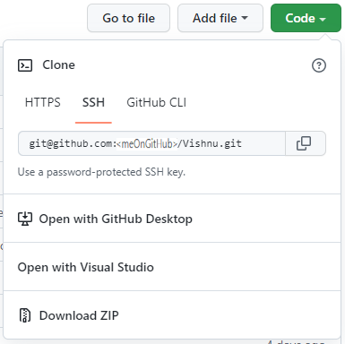

# Project Title

🇬🇧 [English Version](README_en.md)  
🇩🇪 [Deutsche Version](README_de.md)

🇬🇧 [to the English Version]({{ site.baseurl }}/en/)

# Vishnu
### Vishnu ist ein Monitoring- und Prozesssteuerungs-Baukasten mit integrierter Verarbeitung erweiterter logischer Ausdrücke.

*So sieht Vishnu nach dem Start mit dem ersten Demo-Job ungefähr aus*.

## Voraussetzungen

  - Läuft auf Systemen ab Windows 10.
  - Entwicklung und Umwandlung mit Visual Studio 2022 Version 17.8 oder höher.
  - .Net Runtime ab 8.0.2.

## Schnellstart
  - ### Vishnu Quellen
	* Die Quellen findest du hier: [Vishnu auf GitHub](https://github.com/VishnuHome/Vishnu)

  - ### Installation:

	Für die erste Einrichtung führe bitte nachfolgende Schritte aus:
	* Ein lokales Basisverzeichnis für alle weiteren Vishnu- und Hilfs-Verzeichnisse anlegen, zum Beispiel c:\Users\<user>\Documents\MyVishnu.
	* [init.zip](https://github.com/VishnuHome/Setup/raw/master/Vishnu.bin/init.zip) herunterladen und in das Basisverzeichnis entpacken.

	Es entsteht dann folgende Struktur:
      
	

	### Vishnu-Demo:

	- Im Verzeichnis ReadyBin/Vishnu.bin **Vishnu.exe** starten. 
	Hinweis 1: Wenn Windows die passende DotNet-Runtime nachinstallieren möchte, folge bitte den Anweisungen und starte danach Vishnu erneut. 
	Hinweis 2: Wenn die Meldung kommt
	 "Der Computer wurde durch Windows geschützt", bitte einmalig über "Weitere Informationen" gehen und den Start von Vishnu erlauben.

## Demos
Im Unterverzeichnis **DemoJobs** stehen die Job-Definitionen einer Reihe von interessanten Demonstrations-Jobs.

## Dokumentation
Die ausführliche Dokumentation findest du in **Vishnu** mit **F1**, im mit gelieferten **Vishnu_doc.de.chm** oder
online unter [Vishnu online Dokumentation](https://neteti.de/Vishnu.Doc/) 
(Hinweis: Wenn die Hilfedatei (*.chm) nicht korrekt angezeigt werden sollte, sieh bitte im [CHM-HowTo](CHM_HowTo.md) nach.)
#### Stichworte: Windows, wpf, c#, monitoring, job-controlling, logical tree, parallel, desktop, distributed

## Quellcode und Entwicklung

1. Forken des Repositories **Vishnu** über den Button Fork
 (Repository https://github.com/VishnuHome/Vishnu)

   
2. Clonen des geforkten Repositories **Vishnu** in das existierende Unterverzeichnis
	.../MyVishnu/**VishnuHome**
	
	-  in der git-bash über git clone:

		  cd VishnuHome 
		  git clone git@github.com:&lt;meOnGitHub&gt;/Vishnu.git

	-  oder über "Open with GitHub Desktop", wenn du die Desktop-Anwendung bevorzugst
	
	-  nicht empfohlen: über "Download ZIP" kommst du zwar auch an den Quellcode von Vishnu, 
	   hast dann aber keine Anbindung an dein geforktes Repository auf github.
	
   
	

## Die Vishnu-Plugins

Vishnu ist nur die Logik-Maschine, die eigentliche Arbeit machen die Vishnu-Plugins.
Vishnu-Plugins sind kleine Programmteile (DLLs), die von Vishnu zur Laufzeit geladen werden.
Zu den Vishnu-Plugins gehören neben anderen die Checker. 
Checker sind die wesentlichen Vishnu-Akteure. Sie machen die Prüf-Arbeit und liefern
Prüfergebnisse zurück (siehe auch in der Hilfe [Vishnu Akteure](https://neteti.de/Vishnu.Doc/html/bc0ffa08-c936-4fad-8fdb-dbd2279fc360.htm)
und [eigene Checker](https://neteti.de/Vishnu.Doc/html/a3f9771a-ac24-46c0-97df-d2bde6a990e8.htm)).
Vishnu liefert schon eine Reihe von Checkern mit. Diese findest du unter [InPlug](https://github.com/InPlug).

Vishnu-Plugins kannst du genauso forken und clonen wie unter [Quellcode und Entwickung](#Quellcode-und-Entwicklung) schon beschrieben,
nur dass dein lokales Unterverzeichnis das schon vorgesehene **InPlug** sein sollte.
 (Quellen: [InPlug](https://github.com/InPlug))

## Das Basis-Framework
Vishnu arbeitet mit einigen allgemeingültigen DLLs, dem Basis-Framework.
Für den Fall, dass du dir die Quellen davon anschauen willst oder dorthinein debuggen musst,
kannst du dir die zugehörigen Quellen in den dafür vorgesehenen Ordner **WorkFrame** clonen.
 (Quellen: https://github.com/WorkFrame)

---

## Gibt es Support?

#### Kurze Antwort: *nein*. 
#### lange Antwort:
Ich (Erik) programmiere Vishnu aktuell (April 2024) noch allein.
Auch, wenn ich natürlich alle deine/eure Erfahrungberichte, Anregungen, Verbesserungsvorschläge und Fehlermeldungen
mit Interesse verfolge, kann ich im Moment einfach noch nicht absehen, wie sich die Dinge entwickeln werden.
Wo ich kann, werde ich Fehler beheben und Anregungen in meiner persönlichen Priorisierung berücksichtigen.
Aber an dieser Stelle sei noch mal gesagt: Vishnu ist open Source und free.
**Also helft euch selbst und vor allem: gegenseitig.**

## Kommunikation und Mitmachen

**Bitte nutze die Diskusionsthemen ("Issues").**
 Wenn du Fehler entdeckst oder Verbesserungsvorschläge einbringen willst, eröffne bitte zuerst ein neues Diskusionsthema ("New issue").
Bitte prüfe aber vorher, ob ein passendes Thema nicht vielleicht schon existiert. 
Es sind alle Arten von Verbesserungsvorschlägen, aber auch persönliche Erfahrungsberichte herzlich willkommen.
Das müssen nicht unbedingt weltverbessernde Großtaten sein, auch Schreibfehler wollen korrigiert werden.
Insbesondere fehlen mir noch gute Ideen und Lösungen für eine englische Präsenz.
In der Vishnu-Hilfe stehen dazu Anregungen auf den Seiten [Ideensammlung](https://neteti.de/Vishnu.Doc/html/2e84f44c-6249-45dc-bdc2-c656de87c907.htm)
und [bekannte Fehler und Probleme](https://neteti.de/Vishnu.Doc/html/68cd3f39-4a2c-49f3-8a90-b2442b5880a9.htm).

#### Änderungen und Debugging am Plugin- oder Vishnu-Quellcode

**Wichtig:** Mache möglichst keine Änderungen, Korrekturen oder Erweiterungen
am master-branch des Quellcodes, sondern lege zuerst einen eigenen **neuen branch** an. 
Nur so kannst du später deine Verbesserungen eventuell auch zurückliefern (**pull-request**).

Da der Vishnu-Kernel besonders hohen Anforderungen an Korrektheit, Stabilität und Performance unterliegt,
solltest du vielleicht mit Korrekturen, Erweiterungen an - oder Neuerstellung von - Vishnu-Plugins beginnen.
Der Vishnu-Kernel ist darüber hinaus sehr testaufwendig, weshalb Reaktionen möglicherweise länger
auf sich warten lassen können.

#### Änderungen am Quellcode in das Original-Repository zurückspielen

Wenn du Änderungen am Plugin- Framework- oder Vishnu-Quellcode vorgenommen und ausführlich getestet hast,
kannst du deinen eigenen **branch** über einen **"pull request"** zurückliefern. 
Der Branch wird dann begutachtet und bei Erfolg in Vishnu-master übernommen.
Bitte versuche nicht, einen direkt geänderten master-branch zurückzumelden - das würde nicht angenommen.
(siehe auch [Gibt es Support?](#Gibt-es-Support))

---

## Fremde Software, fremde Ideen

[Sandcastle Help File Builder (SHFB)](https://github.com/EWSoftware/SHFB) 
Vielen Dank an Eric Woodruff, EWSoftware.
Ohne den Sandcastle Help File Builder wäre die Vishnu-Dokumentation nicht denkbar.

[Newtonsoft.Json](https://www.newtonsoft.com/json) 
Danke an James Newton-King für seine unverzichtbare Software.

[Demo-Logik für SplashWindow](https://www.codeproject.com/Articles/116875/WPF-Loading-Splash-Screen) 
Dank an Amr Azab und Nate Lowry.

[WPF-Tortendiagrammme](https://www.codeproject.com/Articles/442506/Simple-and-Easy-to-Use-Pie-Chart-Controls-in-WPF) 
Vielen Dank an Kashif Imran auf Code Project.

[Variable Grids](https://rachel53461.wordpress.com/2011/09/17/wpf-grids-rowcolumn-count-properties/) 
Herzlichen Dank an Rachel Lim für ihren fantastischen Blog. Danke auch für ihren Hinweis zu ShutdownMode.OnMainWindowClose.

[Monphasen Berechnung](https://www.codeproject.com/script/Membership/View.aspx?mid=1961229) 
Danke Mostafa Kaisoun für seine Berechnungslogik.

[Geolocation](https://www.geojs.io) 
Vielen Dank an die Entwickler und Sponsoren dieser freien Seite für Geolocation.

[Wettervorhersagen](https://open-meteo.com) und 
[Wetter-Icons](https://www.7timer.info) 
Vielen Dank an das Team von open-meteo.com und auch an Chenzhou Cui und seine Freunde, die die Seite 7timer.info für Wettervorhersagen betreiben.

[Mindest-Informationen über einen Screen](https://stackoverflow.com/questions/1927540/how-to-get-the-size-of-the-current-screen-in-wpf) 
Danke an Nils Andresen auf StackOverflow

[Basisklassen für ViewModels](https://github.com/poma/SshConnect/blob/master/SshConnect/MvvmFoundation/ObservableObject.cs) 
Vielen Dank an Roman Semenov (poma) für diese Starthilfe.

[Visual Commander](https://marketplace.visualstudio.com/items?itemName=SergeyVlasov.VisualCommander) 
Danke auch an Sergey Vlasov für seine hilfreiche Visual Studio Automatisierung.

[SingleInstance](https://stackoverflow.com/users/51170/matt-davis)
Danke an Matt Davis für seine sehr gute Mutex-Lösung.

[inzwischen nicht mehr online: ZIP-Routinen für ZIPs > 4GB mit Passwörtern] 
Danke auch Peter Bromberg für seine Unterstützung bei den Zip-Routinen.

[Equality Converter](https://stackoverflow.com/questions/37302270/comparing-two-dynamic-values-in-datatrigger) 
Dank an Jason Tyler auf stackoverflow.

Dank auch an die vielen weiteren Software-Entwickler/Entwicklerinnen, die ihr Wissen mit uns allen geteilt haben. 

Last but not least geht mein Dank an die Teams von Microsoft für ihre freien Express- und Community-Editions.

### Viel Spass mit Vishnu!
Erik Nagel
